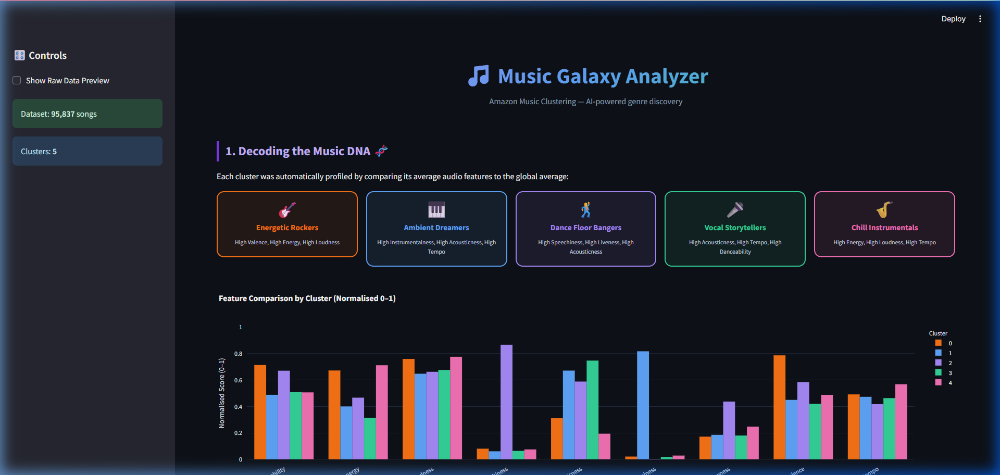
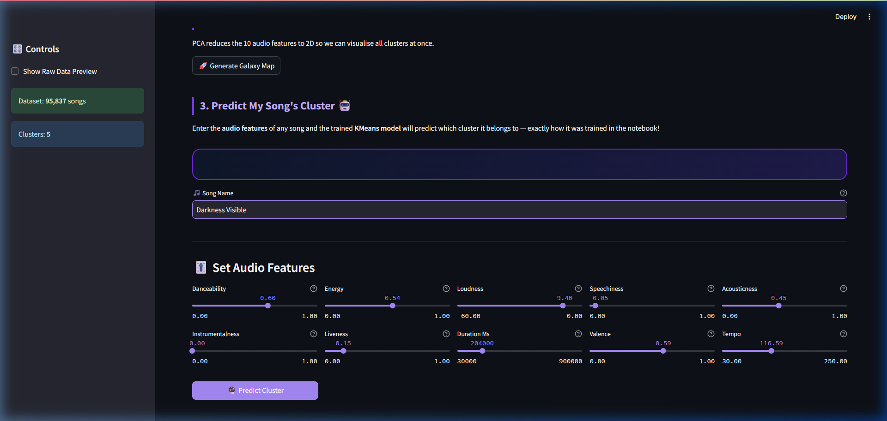
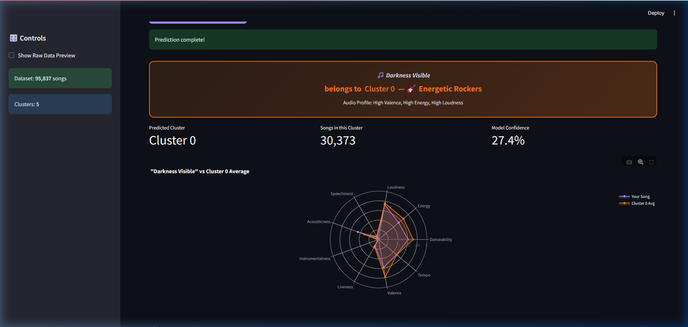
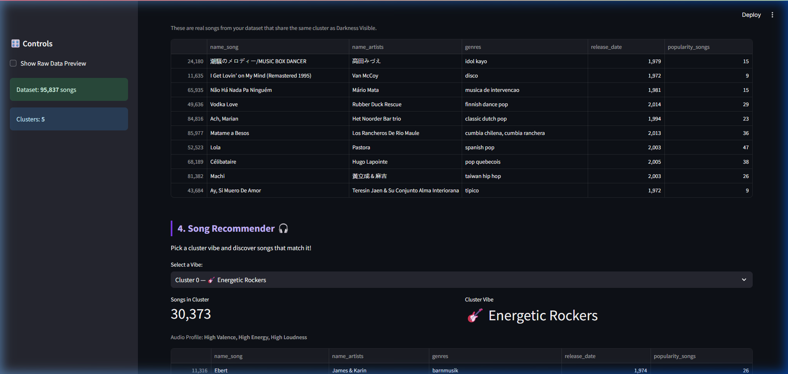

# 🎵 Amazon Music Clustering: The AI DJ

An end-to-end Machine Learning project that performs unsupervised clustering on Amazon music data and deploys the insights via an interactive Streamlit application. The app classifies songs into 5 distinct "vibes", allows you to view the PCA map, and features a "Predict My Song's Cluster" engine.

## 📸 Application Screenshots

### 1. Dashboard Overview & Cluster DNA
Visualizes the 5 unique clusters (e.g., Energetic Rockers, Ambient Dreamers) and compares their distinguishing audio features using a normalized 0-1 radar and bar chart.


### 2. Predict My Song Feature
Allows you to map any custom song by tweaking 10 different audio features (like Danceability, Acousticness, Tempo).


### 3. Prediction Result
The Streamlit app feeds your inputs through the saved `StandardScaler` and into the deployed `KMeans` model to instantly classify your song. 


### 4. Similar Songs Recommendation
After predicting your song's cluster, the AI DJ recommends real songs from the dataset matching that exact vibe.


---

## 📁 Project Structure

| File / Folder | Purpose |
|---|---|
| 📓 `music_clustering.ipynb` | Main analysis notebook (Exploratory Data Analysis, cleaning, handling outliers, finding global $k=5$, applying PCA). |
| 🐍 `train_model.py` | Training script that fits the data exactly as done in the notebook and exports `kmeans_model.pkl` & `scaler.pkl`. |
| 🖥️ `streamlit_app.py` | The main Streamlit web application. |
| 📊 `Final_Amazon_Music_Project.csv`| Processed data generated by the notebook (contains the final `cluster_label`). |
| 📂 `screenshots/` | Images used for documentation. |

---

## 🚀 Quick Start

1. **Install Dependencies**
   ```bash
   pip install pandas numpy matplotlib seaborn scikit-learn streamlit plotly jupyterlab
   ```

2. **Data & Artifact Check**
   Ensure `Final_Amazon_Music_Project.csv`, `kmeans_model.pkl`, and `scaler.pkl` are present in the directory.
   *(If not, re-run `music_clustering.ipynb` to generate the CSV, and `python train_model.py` to generate the pickle files).*

3. **Launch the App**
   ```bash
   streamlit run streamlit_app.py
   ```

---

## 🎧 App Features

1. **Decoding the Music DNA 🧬**: Understand how the KMeans algorithm split the data automatically into 5 aesthetic personality traits using high contrast metrics.
2. **The Music Galaxy Map 🗺️**: A 2D PCA cluster visualization allowing hoverability to inspect data distribution.
3. **Predict My Song 🤖**: Slider-based UI connected directly to the `kmeans_model.pkl` inference to predict custom clusters and generate interactive Radar Charts.
4. **Artist Analysis Tool 🕵️**: Checks what "Vibe" the majority of your favorite artist's discography belongs to.

## 🤝 Contributing
Contributions, visualizations improvements, or bug fixes are welcome. Please open an issue or pull request.

## 📜 License
*Please insert your preferred license.*
